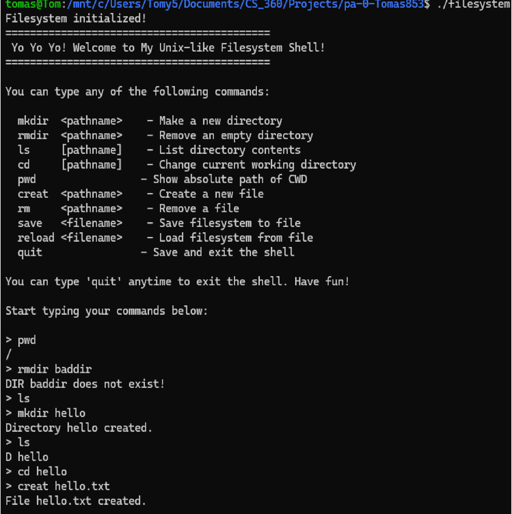

# Tomas Portfolio

## Quick Navigation

### Software Development
- [Recipe Search Mobile App](#recipe-search-mobile-app)
- [Unix Filesystem Simulation](#unix-filesystem-simulation)
- [Movie Rental Application](#movie-rental-application)

### Systems Programming
- [Unix Filesystem Simulator](#unix-filesystem-simulator)
- [Web Proxy Server](#web-proxy-server)

### Embedded Systems
- [FPGA Stopwatch](#fpga-stopwatch)
---

# Software Development

### Recipe Search Mobile App
Flutter application that allows users to search recipes through a public API and view detailed recipe information.

Technologies:
Flutter, Dart, REST APIs

Repository:
[Delishoz](https://github.com/Tom-Yem/Delishoz)

### Unix Filesystem Simulation
A unix-like file system simulator with a few commands

Technologies: 
C, WSL, Github

Repository: 
[Unix Filesystem](https://github.com/Tomas853/Unix-Filesystem-Tree-Simulator)

### Web Proxy Server

A web server that sits in between and relays HTTP requests between a server and a client. 

Technologies: 
C, WSL, GitHub

Repository:
[Web Proxy](https://github.com/Tomas853/Web-Proxy)
